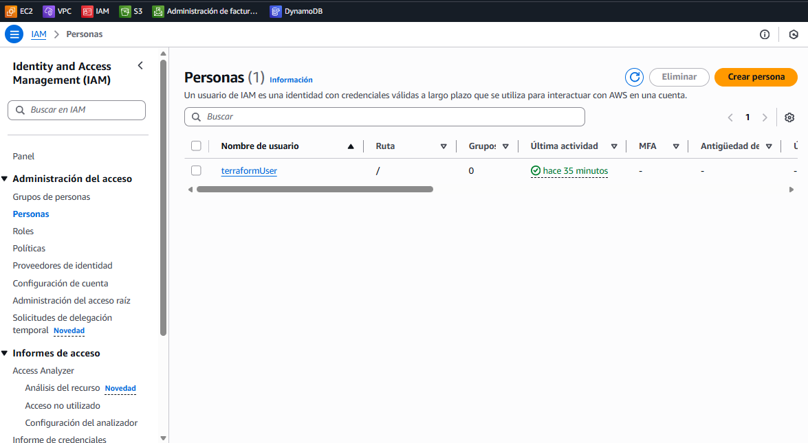
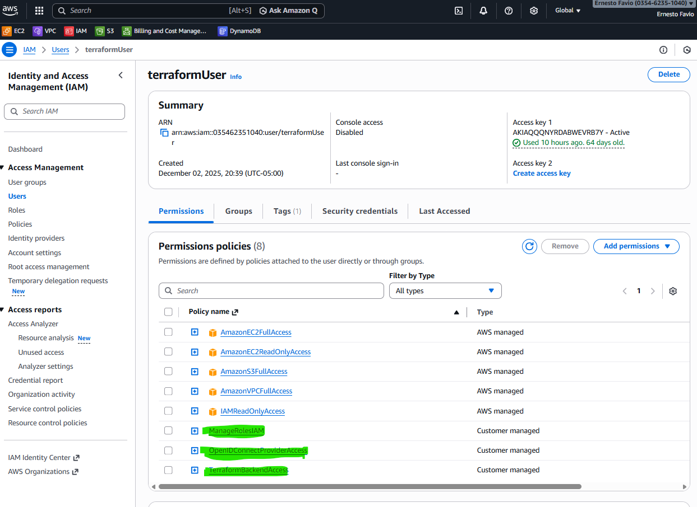
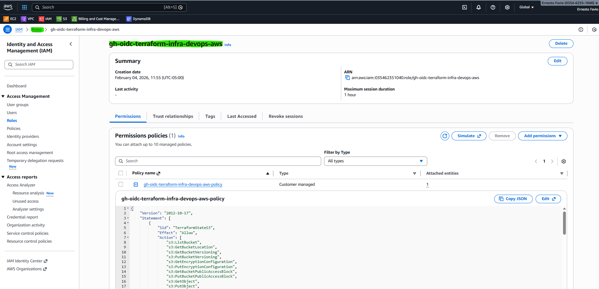
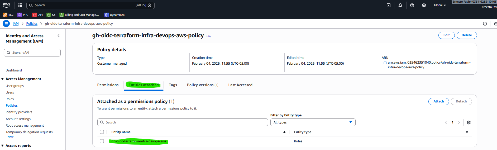
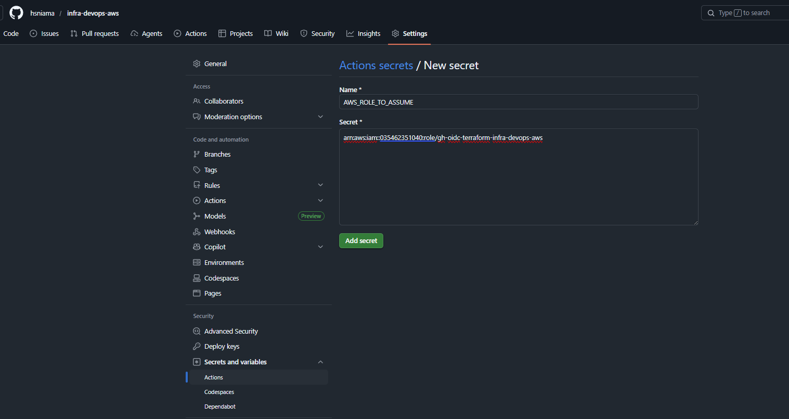

# infra-devops-aws

# Configuración de OIDC en AWS para GitHub Actions + Terraform

Este documento describe cómo configurar un **OpenID Connect (OIDC) Provider** en AWS IAM para permitir que un repositorio de GitHub use **GitHub Actions** y despliegue infraestructura con **Terraform** en AWS **sin usar credenciales estáticas**.

---

## Objetivo
- Crear un usuario IAM dedicado (no administrador) para ejecutar el script de bootstrap.
- Asignar las políticas mínimas necesarias para que ese usuario pueda crear:
  - El OIDC Provider de GitHub.
  - El rol IAM federado con permisos para Terraform.
- Ejecutar el script de bootstrap que automatiza la creación del OIDC Provider, rol y policy.
- Configurar el secreto en GitHub Actions para asumir el rol en AWS.

---

## 1. Crear un usuario IAM dedicado
En lugar de usar la cuenta root o un usuario administrador, se recomienda crear un usuario específico para automatización, por ejemplo:

- Nombre: `terraformUser`
- Acceso: **solo programático** (Access Key + Secret Key).
- Sin acceso a la consola.



Este usuario será el que ejecute el script de bootstrap_oidc.sh y bootstrap_backend.sh.

---

## 2. Crear las políticas necesarias

El usuario `terraformUser` necesita permisos específicos para poder crear el OIDC Provider y los roles asociados. Creamos **dos políticas administradas por el cliente**:

### 2.1 Policy: `OpenIDConnectProviderAccess`
Permite crear y administrar el OIDC Provider de GitHub.

```json
{
  "Version": "2012-10-17",
  "Statement": [
    {
      "Effect": "Allow",
      "Action": [
        "iam:CreateOpenIDConnectProvider",
        "iam:GetOpenIDConnectProvider",
        "iam:DeleteOpenIDConnectProvider"
      ],
      "Resource": "*"
    }
  ]
}
```
### 2.2 Policy: `ManageRolesIAM`
Permite crear y administrar roles y policies IAM necesarias para el pipeline.

```json
{
  "Version": "2012-10-17",
  "Statement": [
    {
      "Effect": "Allow",
      "Action": [
				"iam:CreateRole",
				"iam:GetRole",
				"iam:UpdateAssumeRolePolicy",
				"iam:AttachRolePolicy",
				"iam:CreatePolicy",
				"iam:GetPolicy",
				"iam:CreatePolicyVersion",
				"iam:ListPolicyVersions",
				"iam:DetachRolePolicy",
				"iam:DeletePolicyVersion",
				"iam:DeletePolicy",
        "iam:DeleteRole"
      ],
      "Resource": "*"
    }
  ]
}
```
Adjuntamoa esta 2 policy al usuario terraformUser:



### 3. Ejecutar el script de bootstrap
Con las credenciales del usuario `terraformUser` configuradas en nuestro entorno local o de desarrollo (~/.aws/credentials o variables de entorno), ejecuta en tu terminal:

```bash
chmod +x scripts/bootstrap_oidc.sh
./scripts/bootstrap_oidc.sh <account_id> <repo_full_name> <role_name> <region>
```
Ejemplo:

```bash
./scripts/bootstrap_oidc.sh 035462351040 hsniama/infra-devops-aws gh-oidc-terraform-infra-devops-aws us-east-1
```
En donde <account_id> es el ID de tu cuenta, <repo_full_name> es el nombre completo de tu repositorio, <role_name> es el nombre del rol que asignamos y <region> es la región de AWS en la cual estamos trabajando.

Al ejecutar el script correctamente verás algo como:

```json
==> Ensuring GitHub OIDC provider exists...
OIDC provider already exists: arn:aws:iam::035462351040:oidc-provider/token.actions.githubusercontent.com
==> Creating/updating role: gh-oidc-terraform-infra-devops-aws
Role created.
==> Ensuring policy exists: gh-oidc-terraform-infra-devops-aws-policy
Policy created.
==> Attaching policy to role...

DONE.
Set this GitHub secret in infra-devops-aws repo:
AWS_ROLE_TO_ASSUME = arn:aws:iam::035462351040:role/gh-oidc-terraform-infra-devops-aws
```


#### ¿Qué hace el script?
- Crea/valida el OIDC Provider de GitHub (token.actions.githubusercontent.com).
- Crea un rol IAM con trust policy que permite solo a tu repo (en mi caso: hsniama/infra-devops-aws) asumirlo desde GitHub Actions.

    

- Crea una policy de permisos (ej. gh-oidc-terraform-infra-devops-aws-policy) con acceso a:
    - S3 (backend de Terraform).
    - DynamoDB (lock de Terraform).
    - ECR, VPC, EC2, ELB, EKS, IAM, Autoscaling, Logs, KMS (infraestructura).

    

- Adjunta la policy al rol.

    

En resumen:

- GitHub genera un token OIDC → incluye sub.
- AWS recibe el token → busca el rol → revisa la trust policy.
- Si el sub del token coincide con alguno de los patrones permitidos, AWS deja asumir el rol.

### 4. Configurar GitHub Actions

En tu repositorio de GitHub (hsniama/infra-devops-aws):
1. Ve a Settings → Secrets and variables → Actions → New repository secret.
2. Crea un secreto llamado:

```json
AWS_ROLE_TO_ASSUME = arn:aws:iam::035462351040:role/gh-oidc-terraform-infra-devops-aws
```
En donde el valor de `AWS_ROLE_TO_ASSUME` es el resultado que te da la ejecución del script, debes copiarlo.
    

3. El workflow `terraform.yml` de GitHub Actions, usa este rol (AWS_ROLE_TO_ASSUME) con OIDC para obtener credenciales temporales en AWS.

## Conclusión
Con este setup:

- No necesitas Access Keys en GitHub.
- GitHub Actions obtiene credenciales temporales vía OIDC y permite que se autentique en AWS sin usar llaves estáticas.
- Terraform puede desplegar infraestructura en AWS de forma segura y automatizada.
- El usuario terraformUser (en mi caso) tiene permisos mínimos para crear el OIDC, sin ser administrador, gracias a las policy previamente añadidas.

## Anexos

### 1. Explicación rol `gh-oidc-terraform-infra-devops-aws`

El rol `gh-oidc-terraform-infra-devops-aws`
Es un IAM Role en tu cuenta AWS.
Tiene dos cosas importantes:
- Trust policy → define quién puede asumirlo. En tu caso:
    - Solo el OIDC provider de GitHub (token.actions.githubusercontent.com).
    - Solo tu repo (hsniama/infra-devops-aws) y ramas específicas (main, test/*, pull_request).
- Permissions policy (`gh-oidc-terraform-infra-devops-aws-policy`) → define qué puede hacer una vez asumido.
    - Crear VPCs, EC2, EKS, S3, DynamoDB, etc. (todo lo que Terraform necesita).

**¿Quién usa este rol?**
- No lo usamos nostros directamente con el usuario `terraformUser`.
- Lo usa GitHub Actions cuando corre el  pipeline.

**¿Cómo lo usa GitHub Actions?**
1. En tu workflow de GitHub Actions, configuras el secreto:
```json
AWS_ROLE_TO_ASSUME: arn:aws:iam::035462351040:role/gh-oidc-terraform-infra-devops-aws
```
2. GitHub genera un token OIDC cuando se ejecuta el pipeline.
3. AWS valida ese token contra el OIDC provider que creaste.
4. Si el token corresponde a tu repo y rama permitida → AWS deja que GitHub asuma el rol.
5. Al asumir el rol, GitHub obtiene credenciales temporales (STS) con los permisos de la policy.
6. Terraform, dentro del pipeline, usa esas credenciales para desplegar infraestructura en AWS.

**Ventajas de este modelo**
**Seguridad**: no se necesita guardar AWS_ACCESS_KEY_ID y AWS_SECRET_ACCESS_KEY en GitHub.
**Temporalidad**: las credenciales duran minutos, no son llaves permanentes.
**Control fino**: solo tu repo y ramas específicas pueden asumir el rol.