# Repo: infra-devops-aws (Terraform + GitHub Actions + AWS + OIDC)

Disponible en [Español](README.es.md)

---
Post: https://dev.to/hsniama/i-built-the-aws-platform-that-every-devops-engineer-would-want-to-have-11fl

---

## Table of Contents
- [1. Project Overview](#1-project-overview)
- [2. Architecture](#2-architecture)
- [3. AWS Infrastructure Components](#3-aws-infrastructure-components)
- [4. Project Structure](#4-project-structure)
  - [4.1 Environments](#41-environments)
- [5. Project Setup](#5-project-setup)
- [6. CI/CD Pipeline Execution](#6-cicd-pipeline-execution)
  - [6.1 Outputs and Artifacts](#61-outputs-and-artifacts)
  - [6.2 Cluster Connection](#62-cluster-connection)
  - [6.3 Cleanup](#63-cleanup)
- [7. Security](#7-security)
- [8. Conclusion](#8-conclusion)
- [9. Glossary and Technical Concepts](#9-glossary-and-technical-concepts)

## 1. Project Overview
This repository does not deploy applications directly. Its goal is to provision foundational infrastructure in AWS (EKS, ECR, VPC, OIDC) with environment separation (test/prod) and deliver the required outputs so other repositories (for example, microservices) can deploy securely and automatically.

When the pipeline finishes (depending on the environment), key values are generated:

| Output              | Descripción                                |
|---------------------|--------------------------------------------|
| aws_region          | region where infrastructure was deployed   |
| ecr_repository_name | ECR repository name                        |
| ecr_repository_url  | URL para `docker push`                     |
| eks_cluster_name    | EKS cluster name                           |
| eks_cluster_endpoint| API server endpoint for `kubectl`          |
| eks_oidc_issuer     | OIDC issuer, useful for IRSA               |


This project demonstrates how to build the foundational infrastructure that DevOps teams will use daily—without recreating it every time.

**You build once. They deploy forever.**

### The workflow:
1. **Platform Engineer** (you): Fork this repo, deploy to your AWS account (~30 min)
2. **DevOps Team** (them): Receive outputs (ECR_URL, EKS_ENDPOINT) and deploy apps

These outputs must be consumed by the application pipeline, enabling it to:

- Build and push Docker images to ECR.
- Connect to the EKS cluster with kubectl.
- Configure service account roles through OIDC.

Therefore, this project shows how to deploy modern AWS infrastructure using Terraform and GitHub Actions, applying security best practices (OIDC, least privilege) and environment separation (test/prod). The services used are:

- Dedicated IAM user with least-privilege policies to deploy infrastructure components.
- Custom VPCs with public subnets (Load Balancers) and private subnets (EKS nodes).
- NAT Gateway with EIP and route tables.
- Amazon ECR (Elastic Container Registry).
- Amazon EKS (Elastic Kubernetes Service) with Managed Node Group.
- IAM role for GitHub Actions (OIDC).
- Cluster access via EKS Access Entries enabled with `authentication_mode = "API_AND_CONFIG_MAP"`.
- Terraform remote state in S3.
- State locking with DynamoDB.
- CI/CD: GitHub Actions + OIDC.
- Two separate environments: TEST and PROD with different flows.

## 2. Architecture

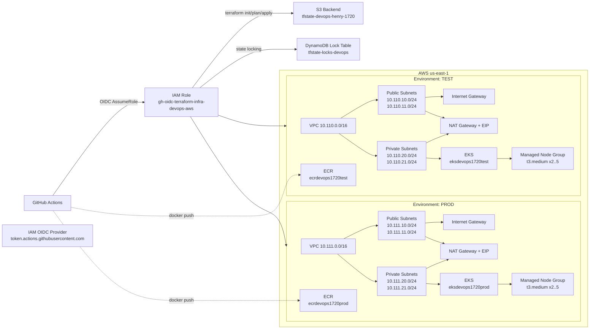
```mermaid
flowchart LR
  GH[GitHub Actions]
  OIDC[IAM OIDC Provider<br/>token.actions.githubusercontent.com]
  ROLE[IAM Role<br/>gh-oidc-terraform-infra-devops-aws]
  STATE[S3 Backend<br/>tfstate-devops-henry-1720]
  LOCKS[DynamoDB Lock Table<br/>tfstate-locks-devops]

  GH -->|OIDC AssumeRole| ROLE
  ROLE -->|terraform init/plan/apply| STATE
  ROLE -->|state locking| LOCKS

  subgraph AWS[AWS us-east-1]
    subgraph TEST[Environment: TEST]
      TVPC[VPC 10.110.0.0/16]
      TPUB[Public Subnets<br/>10.110.10.0/24<br/>10.110.11.0/24]
      TPRI[Private Subnets<br/>10.110.20.0/24<br/>10.110.21.0/24]
      TIGW[Internet Gateway]
      TNAT[NAT Gateway + EIP]
      TEKS[EKS<br/>eksdevops1720test]
      TNODES[Managed Node Group<br/>t3.medium x2..5]
      TECR[ECR<br/>ecrdevops1720test]
    end

    subgraph PROD[Environment: PROD]
      PVPC[VPC 10.111.0.0/16]
      PPUB[Public Subnets<br/>10.111.10.0/24<br/>10.111.11.0/24]
      PPRI[Private Subnets<br/>10.111.20.0/24<br/>10.111.21.0/24]
      PIGW[Internet Gateway]
      PNAT[NAT Gateway + EIP]
      PEKS[EKS<br/>eksdevops1720prod]
      PNODES[Managed Node Group<br/>t3.medium x2..5]
      PECR[ECR<br/>ecrdevops1720prod]
    end
  end

  ROLE --> TEST
  ROLE --> PROD

  TVPC --> TPUB
  TVPC --> TPRI
  TPUB --> TIGW
  TPUB --> TNAT
  TPRI --> TNAT
  TPRI --> TEKS
  TEKS --> TNODES
  GH -. docker push .-> TECR

  PVPC --> PPUB
  PVPC --> PPRI
  PPUB --> PIGW
  PPUB --> PNAT
  PPRI --> PNAT
  PPRI --> PEKS
  PEKS --> PNODES
  GH -. docker push .-> PECR
```

A clearer version of the architecture is shown below.
  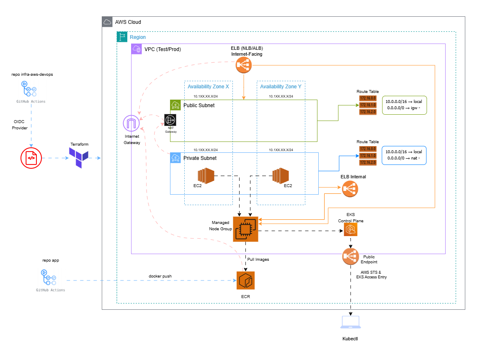

If you want more detail, go to `assets/diagrams` and you will find out the CI/CD, and Network Diagrams.

## 3. AWS Infrastructure Components

- **Region**: `us-east-1`
- **Terraform remote backend**
  - S3 for state: `tfstate-devops-henry-1720`
    - keys (separate states per environment inside the same backend)
      - `test/infra.tfstate`
      - `prod/infra.tfstate`
  - DynamoDB for locking: `tfstate-locks-devops`

- **Dev infrastructure**:
  - vpc_name: `vpc-infra-aws-test`
    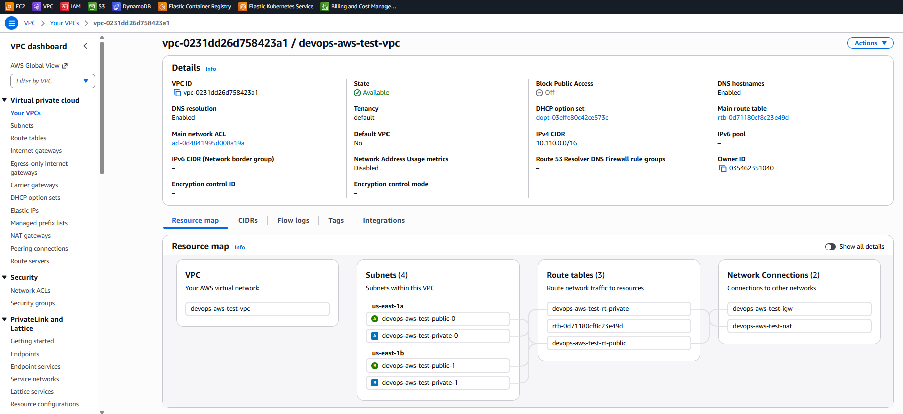
    - Elastic Kubernetes Service (EKS): `eksdevops1720test`
      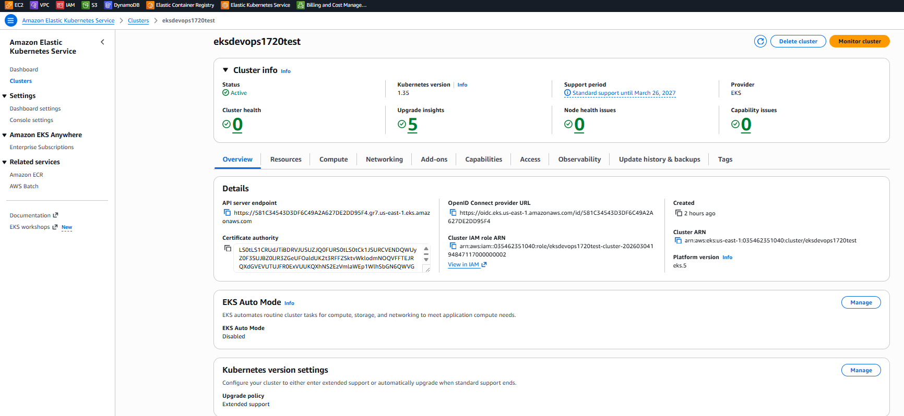
    - Elastic Container Registry (ECR): `ecrdevops1720test`

- **Prod infrastructure**:
  - vpc_name: `vpc-infra-aws-prod`
    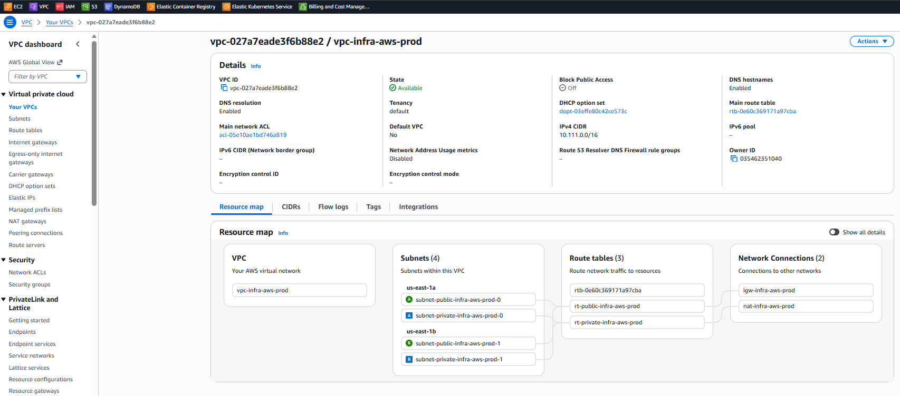
    - Elastic Kubernetes Service (EKS): `eksdevops1720prod`
      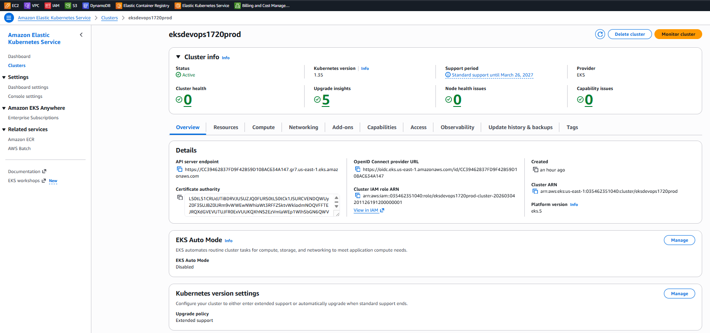
    - Elastic Container Registry (ECR): `ecrdevops1720prod`

In summary:

- Dedicated VPC per environment
  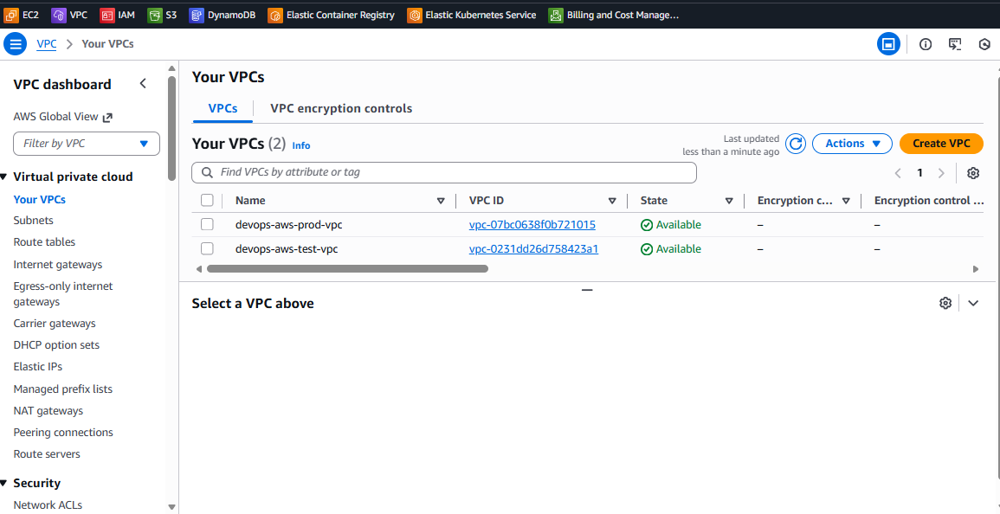
  - Subnets
  - Route Tables
  - Internet Gateways
- EKS cluster per environment v1.35
  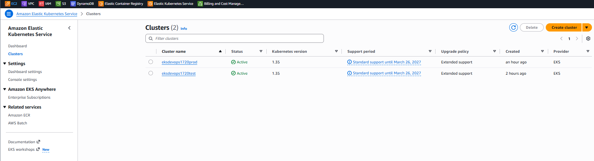
- ECR repositories per environment for Docker images
  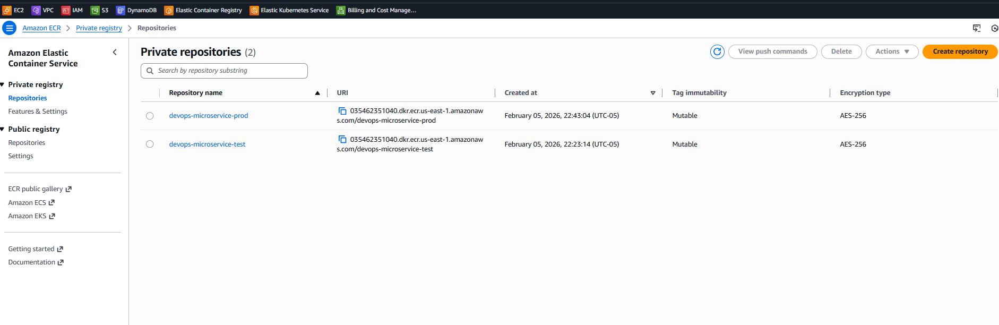

## 4. Project Structure

```text
infra-devops-aws/
├── .github/
│   ├── workflows/
│   │   ├── destroy-infra-prod.yml
│   │   ├── destroy-infra-test.yml
│   │   └── terraform.yml
├── terraform/
│   ├── modules/
│   │   ├── vpc
│   │   ├── eks
│   │   └── ecr
│   ├── backend.tf
│   ├── locals.tf
│   ├── main.tf
│   ├── outputs.tf
│   ├── providers.tf
│   ├── variables.tf
│   └── versions.tf
├── environments/
│   ├── test.tfvars
│   └── prod.tfvars
├── backends/
│   ├── test.hcl
│   └── prod.hcl
├── scripts/
│   ├── bootstrap_backend.sh
│   ├── bootstrap_oidc.sh
│   ├── destroy_backend.sh
│   └── destroy_oidc.sh
└── README.md
```

- workflows/ → deployment and destroy pipelines.
- modules/ → reusable modules (VPC, EKS, ECR).
- environments/ → environment-specific variables (test/prod).
- backends/ → remote backend configuration (S3 + DynamoDB).
- scripts/ → initial bootstrap automation.

### 4.1 Environments

There are 2 environments in this project:

- **TEST**: any push to `dev/**` branches deploys to DEV, meaning automatic deploy without manual approval.
- **PROD**: merge to `main` deploys to PROD and requires manual approval in GitHub Environment.

Terraform remote state uses separate keys but the same S3 bucket:

- `test/infra.tfstate`

   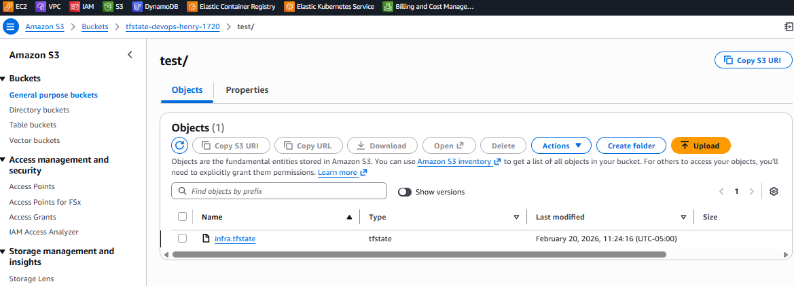
   Go to file [backends/dev.hcl](./backends/dev.hcl)

- `prod/infra.tfstate`

   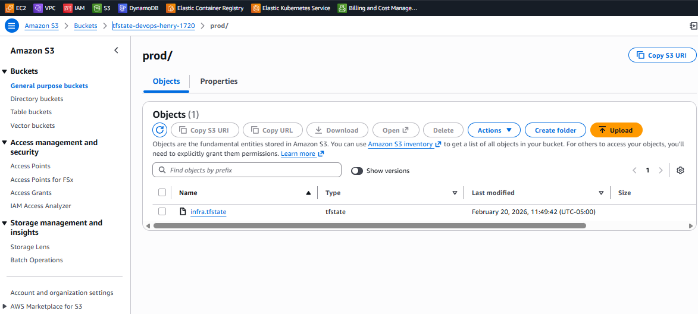
   Go to file [backends/prod.hcl](./backends/prod.hcl)

## 5. Project Setup

**0. Clone the repository:**
```bash
git clone https://github.com/hsniama/infra-devops-aws
cd infra-devops-aws
```

---

**1. Configure AWS CLI**
```bash
aws configure
```
You will be asked to enter the following values:
- `AWS Access Key ID` → `<your key>`
- `AWS Secret Access Key` → `<your secret key>`
- `Default region name` → us-east-1
- `Default output format` → json

Verify identity:
```bash
aws sts get-caller-identity
```

Important note:

1. Before configuring your account with `aws configure` and validating it with `aws sts get-caller-identity`, you must first create a new IAM user in AWS and obtain the AccessKeyID and SecretAccessKey.
2. Once you have created your IAM account or user, completed its configuration, and validated its identity, there are two key options to consider for granting CRUD permissions to the services and resources managed by Terraform:

  a. **IAM user with AdministratorAccess** *(No Recommended)*: manually attach the `AdministratorAccess` policy (AWS managed) to the new IAM user to have full access to AWS services and resources.

     

  b. **IAM user with Managed Policies** *(Recommended)*: attach customer-managed policies with exact permissions needed for this project, reducing the risk of over-permissioning. This custom setup is described here: [User Configuration](./assets/Readmes/ConfigUser.md). However, for the sake of time and simplicity, you could follow option A mentioned above.

    
---

**2. Create remote backend (S3 + DynamoDB)**
Once the policies mentioned in the previous section have been added, run the `bootstrap_backend.sh` script:
```bash
chmod +x scripts/bootstrap_backend.sh
scripts/bootstrap_backend.sh <region> <bucket_name> <dynamodb_table>
```
Example:
```bash
./scripts/bootstrap_backend.sh us-east-1 tfstate-devops-henry-1720 tfstate-locks-devops
```
Where `<region>` is the AWS region in use, `<bucket_name>` is the full bucket name to create, and `<dynamodb_table>` is the DynamoDB table name.

This script creates:
- S3 bucket for state: `tfstate-devops-henry-1720`
  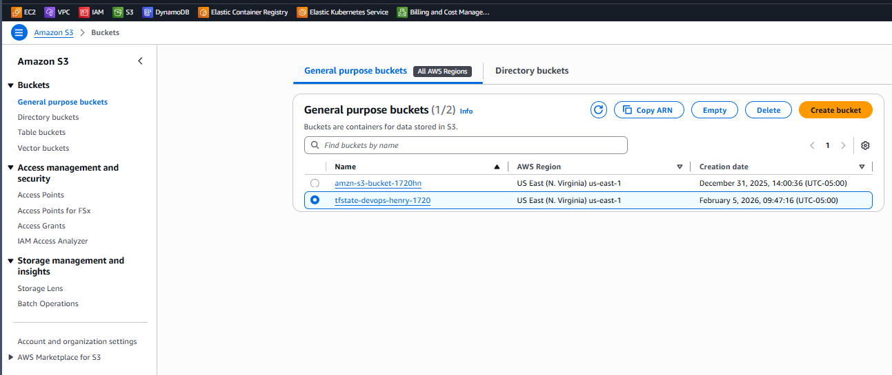
- DynamoDB table for locking: `tfstate-locks-devops`
  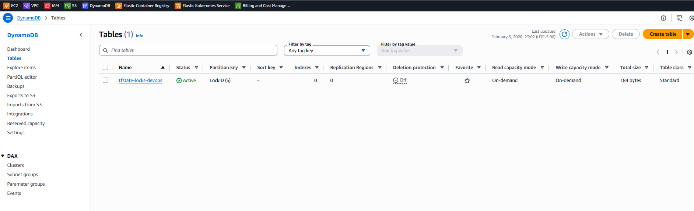
- Keys for test and prod environments
  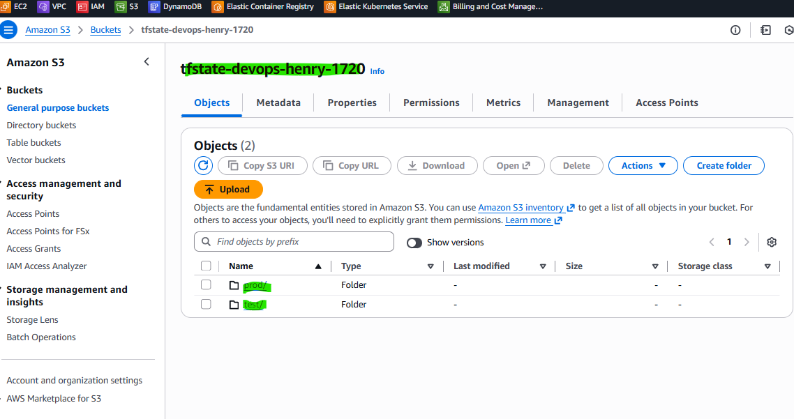

Save generated values for *bucket*, *key*, *region*, and *dynamodb_table* and put them in files:
- `backends/dev.hcl`
- `backends/dev.hcl`

---

**3. Create IAM role for OIDC (GitHub Actions)**
Run script `bootstrap_oidc.sh`:
```bash
chmod +x scripts/bootstrap_oidc.sh
./scripts/bootstrap_oidc.sh <account_id> <repo_full_name> <role_name> <region>
```
Example:
```bash
./scripts/bootstrap_oidc.sh 035462351040 hsniama/infra-devops-aws gh-oidc-terraform-infra-devops-aws us-east-1
```
Where `<account_id>` is your AWS account ID, `<repo_full_name>` is your full GitHub repository name, `<role_name>` is the role name to assign, and `<region>` is the AWS region in use.

This script creates:

- IAM role: `gh-oidc-terraform-infra-devops-aws`
- Trust policy with GitHub OIDC
- Sufficient permissions for creating the following resources:
  - EKS
  - ECR
  - VPC
  - S3
  - IAM
  - DynamoDB

Script output example:

```json
DONE.
Set this GitHub secret in infra-devops-aws repo:
AWS_ROLE_TO_ASSUME = arn:aws:iam::0354623XXXXX:role/gh-oidc-terraform-infra-devops-aws
```

You must save the generated `AWS_ROLE_TO_ASSUME` ARN as a GitHub secret in your repository, explained later.

In conclusion, you will have role `gh-oidc-terraform-infra-devops-aws` with policy `gh-oidc-terraform-infra-devops-aws-policy` attached.

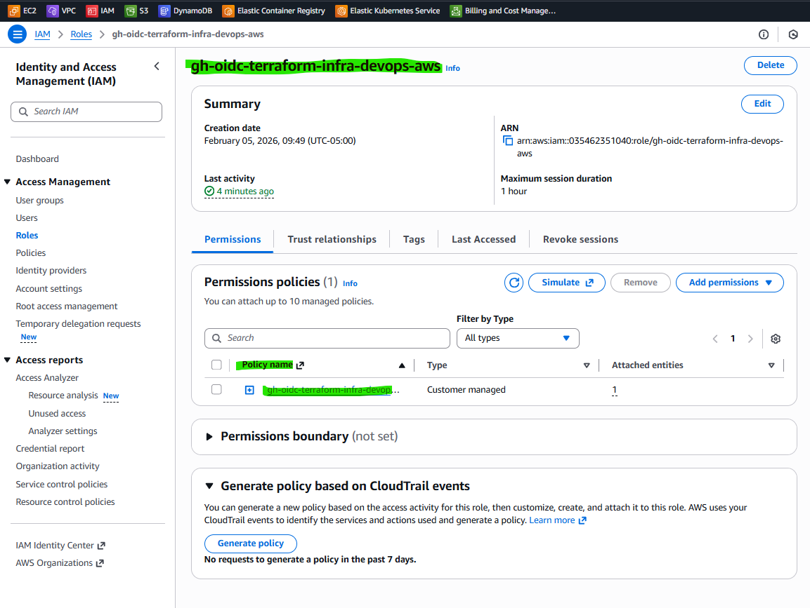

Note:  
GitHub Actions uses an IAM OIDC Role to deploy the infrastructure and:

- Create resources such as VPC, EKS, ECR, and more.
- Generate an Access Entry for the `terraformUser` (in my case), enabling it to manage the EKS cluster.


To understand this script in detail, go to the [Appendix](./assets/Readmes/Anexos.md).

---

**4. GitHub Environments configuration**

Create environments in repo > settings > Environments:
- `dev`
- `prod`: enable "Required reviewers" so prod cannot apply without approval.

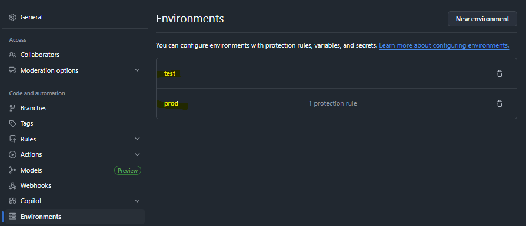

For `prod`, in *Required reviewers*, set yourself as reviewer:

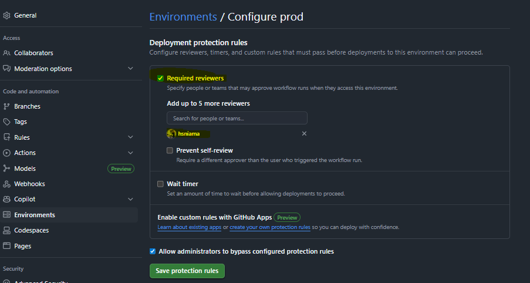

---

**5. Create GitHub Secrets and Variables**

Create this secret (from `bootstrap_oidc.sh`) with its value in repo > settings > secrets & variables > actions > secrets:

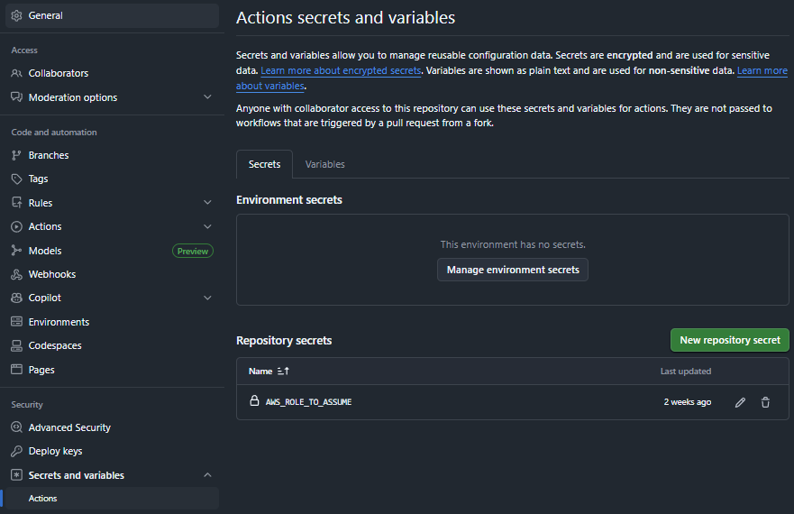

In this case:
- `AWS_ROLE_TO_ASSUME` → arn:aws:iam::03546XXXX:role/gh-oidc-terraform-infra-devops-aws

The GitHub Actions workflow `terraform.yml` uses this role (`AWS_ROLE_TO_ASSUME`) with OIDC to get temporary AWS credentials.

Then create this variable in Actions > Variables:


In this case:
- `AWS_REGION` → us-east-1

---

**6. Set Terraform variables**

You must specify values for the following variables, which must be globally unique in AWS:

- eks_name
- ecr_repo_name
- principal_arn of the IAM user created in earlier steps (get it by running `aws sts get-caller-identity`)
- principal_arn of the GitHub Actions OIDC role (result of `bootstrap_oidc.sh` in step 3)

For `DEV`, modify variables in `enviroments/dev.tfvars`:
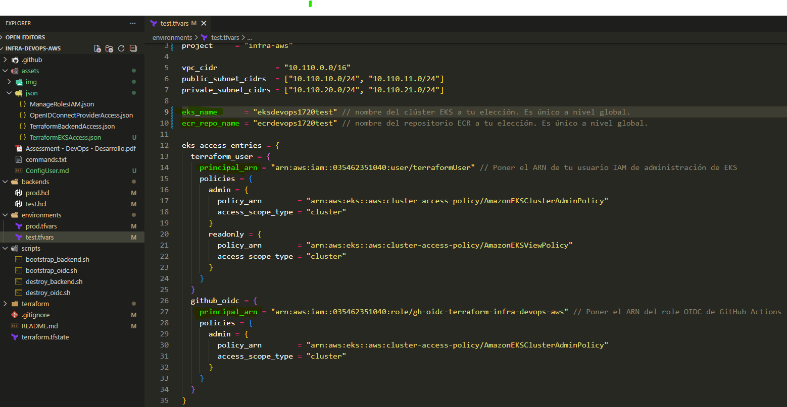
For `PROD`, modify variables in `enviroments/prod.tfvars`:
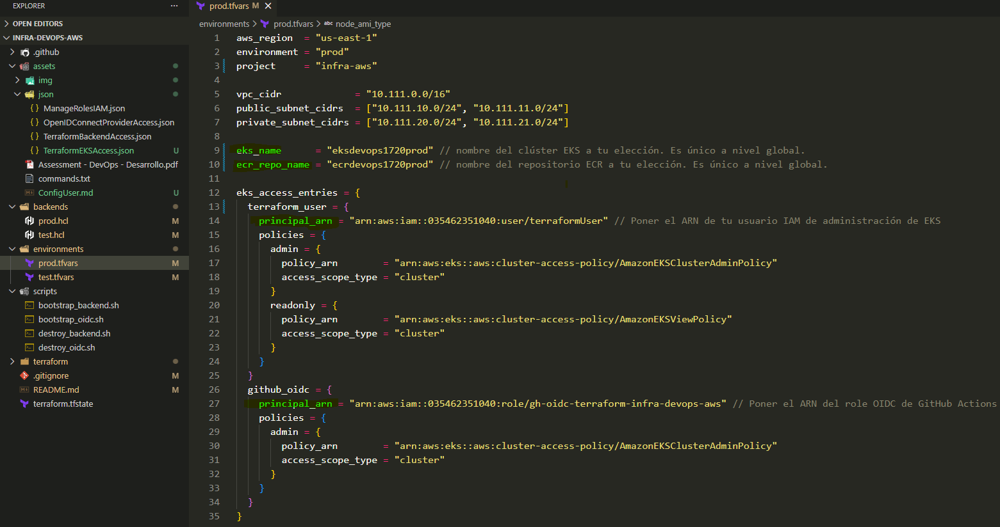

Other variables like `node_instance_types`, `node_ami_type`, and the rest are optional.

## 6. CI/CD Pipeline Execution

**Workflow: terraform.yml**

This pipeline is located at [.github/workflows/terraform.yml](./.github/workflows/terraform.yml) and is designed to manage AWS infrastructure deployments with Terraform + GitHub Actions, differentiating between test and prod environments based on the triggering event.

The workflow runs in different ways:

For `TEST`:

1. Push to `dev/**` branches
- Runs plan + apply in test environment after `git commit -m ""` and `git push`.
- Allows validating changes in the test environment without affecting production.

For `PROD`:

1. Pull Request to main
- Runs `Terraform plan` in prod mode.
- Lets you review what changes would be applied to production before merge.
- Does not run apply, only shows the plan.

2. Merge to main
- Runs plan + apply in prod after PR merge approval.
- Deploys real production infrastructure.

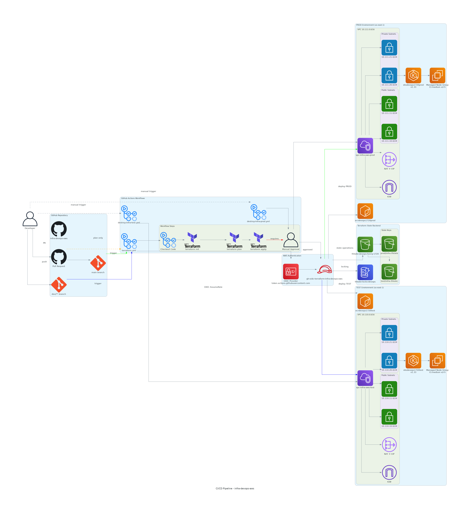

---

Note:
To validate and inspect infrastructure quickly without making changes, commits, pushes, or opening/approving PRs, this workflow can also be run manually (`workflow_dispatch`) for both `TEST` and `PROD`:

- Lets you trigger the workflow from GitHub Actions UI.
- Has an `environment` input with `test` or `prod`.
- Useful for tests and controlled deployments.

Go to Actions > Workflows > terraform.yml > Run Workflow and choose `Branch: dev/henry` for `TEST` or `Branch: main` for `PROD`. Then click Run Workflow and the pipeline will execute.

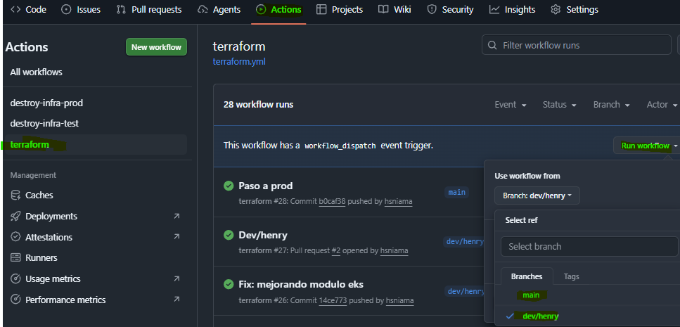

Remember: for PROD, the pipeline runs but still requires reviewer approval configured in GitHub Environments.

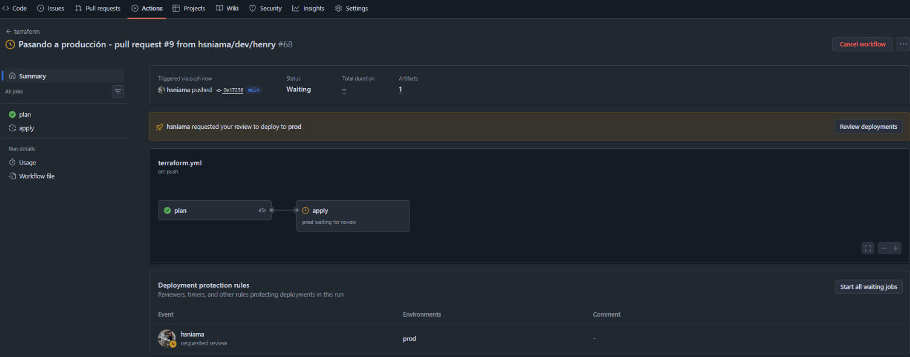

For more details on how this workflow works and what it contains, go to the [Appendix](./assets/Readmes/Anexos.md).

### 6.1 Outputs and Artifacts

After the pipeline completes successfully, check the step:

**Terraform output**

Required values:

- aws_region → region where infrastructure was deployed.
- ecr_repository_name → ECR repository name.
- ecr_repository_url → URL for docker push.
- eks_cluster_name → EKS cluster name.
- eks_cluster_endpoint → API server endpoint for kubectl.
- eks_oidc_issuer → OIDC issuer, useful for IRSA (roles for service accounts).

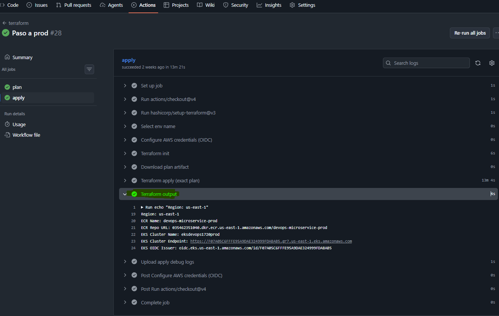

These are used by the microservices repository for:
- docker build
- docker push to ECR
- aws eks update-kubeconfig
- kubectl apply

In other words, these variables/outputs are used in the microservices repository as follows:
- Build & Push: the microservice builds its Docker image and pushes it to `ecr_repository_url`.
- Deploy: it uses `eks_cluster_name` and `eks_cluster_endpoint` to connect with kubectl and apply manifests.
- Auth: it uses `eks_oidc_issuer` if service account roles (IRSA) are configured.

Also, after pipeline execution, GitHub Actions stores these artifacts from the jobs:
- terraform-plan-logs-prod/test → log file (`terraform.log`) generated during plan. Useful for debugging if something fails or to review planned resource changes.
- terraform-apply-logs-prod/test → log file (`terraform.log`) generated during apply. Records everything Terraform actually did in AWS.
- tfplan-prod/test → exact Terraform plan output (`terraform plan`). Used as input for apply to ensure exactly what was reviewed is applied.

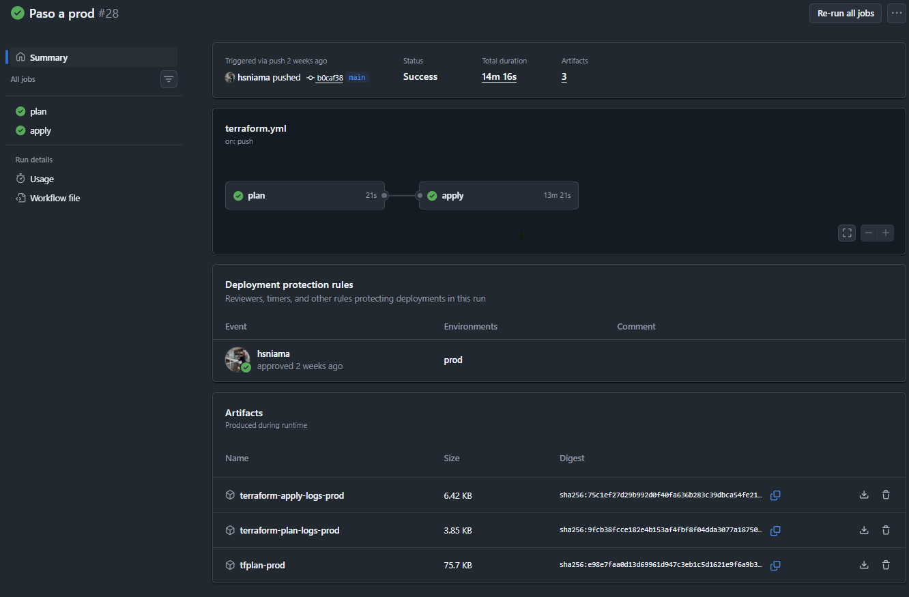.

### 6.2 Cluster Connection

Once `terraform.yml` finishes successfully, you can connect to the cluster with:
```bash
aws eks update-kubeconfig --region <REGION> --name <CLUSTER_NAME>
```
Where:
- `<REGION>` → the region configured earlier.
- `<CLUSTER_NAME>` → `eks_name` configured in `.tfvars` files.

Example:
```bash
aws eks update-kubeconfig --region us-east-1 --name eksdevops1720test

kubectl get nodes
```

.

Access is enabled through EKS Access Entries. You can list all configured entries with:

```bash
aws eks list-access-entries --cluster-name <CLUSTER_NAME> --region <REGION>
```

Note:
- An Access Entry links an IAM principal (user or role) to cluster access policies (for example admin or readonly). The result shows each ARN with cluster access and associated policies.

.

After connecting to the cluster, you can build and push the image to the ECR repository using the pipeline output *ECR Repo URL*:

For example:
```bash
aws ecr get-login-password --region us-east-1 \
  | docker login --username AWS --password-stdin <ECR_REPO_URL>

docker build -t devops-microservice-test .
docker tag devops-microservice-test:latest \
  <ECR_REPO_URL>/devops-microservice-test:latest

docker push <ECR_REPO_URL>/devops-microservice-test:latest
```

Where:
- `<ECR_REPO_URL>` can be `035462531040.dkr.ecr.us-east-1.amazonaws.com`

You could also create and expose Kubernetes manifests and services in the cluster via another pipeline in another repository (application repository).

### 6.3 Cleanup
These two workflows are used to clean up infrastructure.

If you want to delete `TEST` infrastructure, run workflow `destroy-infra-test.yml` manually selecting branch `Branch:dev/henry`.
.

If you want to delete `PROD` infrastructure, run workflow `destroy-infra-prod.yml` manually selecting branch `Branch:main`. However, reviewer approval is required.
.

## 7. Security

Security details are explained in the following section.

[Click Here](./assets/Readmes/Security.md).

## 8. Conclusion
In this project:

- Access keys are not needed in GitHub.
- GitHub Actions gets temporary credentials via OIDC and authenticates to AWS without static keys.
- Terraform can deploy AWS infrastructure (according to this project requirements) in a secure and automated way.
- The `terraformUser` user (in this case) has minimum required permissions (least privilege) to create OIDC without being an administrator, thanks to previously attached policies.

## 9. Glossary and Technical Concepts

To review the technical concepts and definitions used in this project, [click here](./assets/Readmes/Glossary.md).

## 10 Contact & Community

For any questions: **henryniama@hotmail.com**

⭐ Give this project a star on GitHub  
🔄 Share it with your team  
💬 Leave your feedback and comments  
🤝 Contribute to the project
